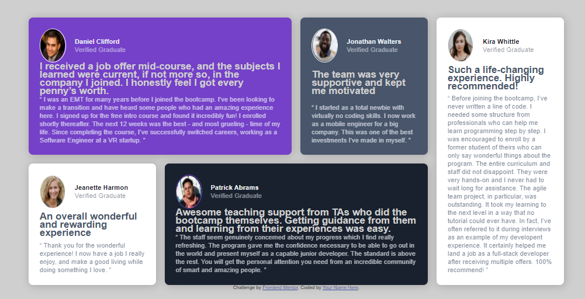

# Frontend Mentor - Testimonials grid section solution

This is a solution to the [Testimonials grid section challenge on Frontend Mentor](https://www.frontendmentor.io/challenges/testimonials-grid-section-Nnw6J7Un7). Frontend Mentor challenges help you improve your coding skills by building realistic projects. 

## Table of contents

- [Overview](#overview)
  - [The challenge](#the-challenge)
  - [Screenshot](#screenshot)
  - [Links](#links)
- [My process](#my-process)
  - [Built with](#built-with)
  - [What I learned](#what-i-learned)
  - [Continued development](#continued-development)
  - [Useful resources](#useful-resources)
- [Author](#author)
- [Acknowledgments](#acknowledgments)


## Overview

### The challenge

Users should be able to:

- View the optimal layout for the site depending on their device's screen size

### Screenshot



### Links

- Solution URL: [Add solution URL here](https://your-solution-url.com)
- Live Site URL: https://m-kgobe.github.io/testimonials-grid-section-main/

## My process

### Built with

- Semantic HTML5 markup
- CSS custom properties
- Flexbox
- CSS Grid
- Mobile-first workflow

### What I learned

*adding google fonts to HTML and CSS
*using box-shadow


To see how you can add code snippets, see below:


```css
.name{
box-shadow: 2px 2px 20px rgba(0,0,0,0.2);
}
body{
    justify-content: center;  
    align-items: center;
    margin: auto;
}
```

### Continued development

1. I would like to focus more on aligning grids to a specific position on the wepage, I seem to  take longer to figure out that, perhaps even try out new grid displays.
2. Distinguish where to use a grid vs flexbox.
3. Making a background image in grid.


### Useful resources


## Author

- Website - [Add your name here](https://www.your-site.com)
- Frontend Mentor - [@M-Kgobe](https://www.frontendmentor.io/profile/M-Kgobe)
- Twitter - [@M_kgobe](https://www.twitter.com/M_kgoe)


## Acknowledgments

Always gotta give thanks to the stackoverflow, freecodecamp, github communities.
